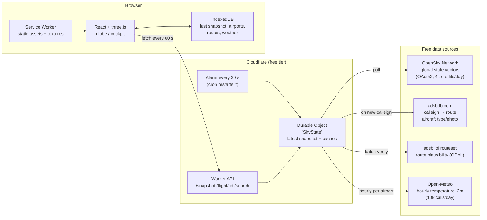
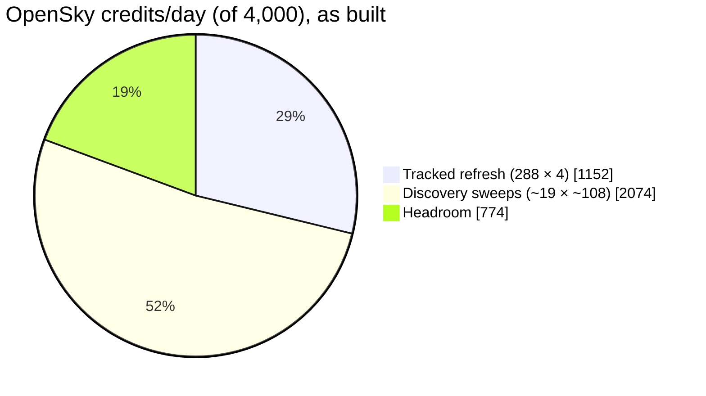
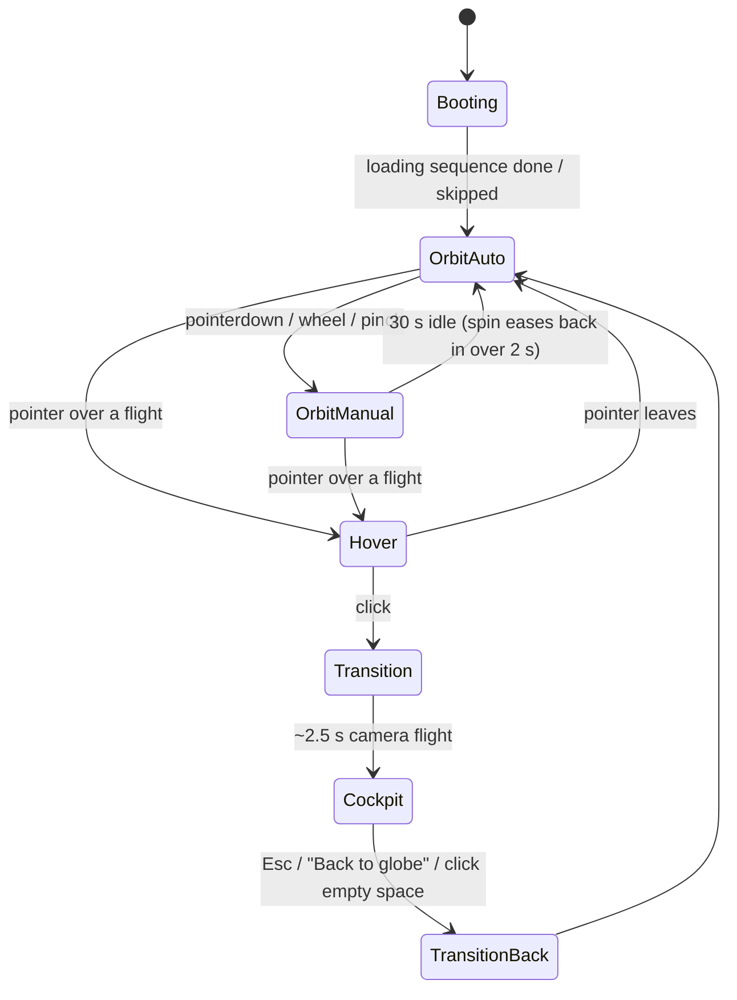
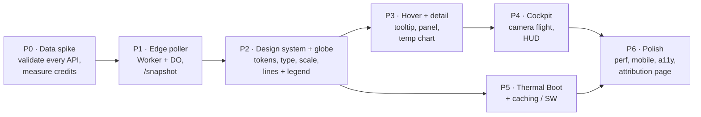

# Flight Flux: Product & Technical Plan

> **Summary.** Flight Flux is a web app built around a slowly spinning 3D globe. It shows about 150 curated long-haul flights that are in the air right now. Each flight path is a glowing line whose color blends from the **temperature at the departure city when the flight left** to the **forecast temperature at the arrival city when it lands**.
>
> All data comes from **free, keyless or free-account APIs**:
> - **OpenSky Network** for live positions
> - **adsbdb** and **adsb.lol** for callsign → route lookups
> - **Open-Meteo** for temperatures
>
> A small **Cloudflare Worker** polls these sources on behalf of every user, so rate limits are shared rather than multiplied per visitor. The browser caches heavily (Service Worker plus IndexedDB), so repeat visits show flights almost at once.
>
> A **"thermal boot" loading sequence** is driven by real loading progress. A wireframe globe assembles, transponder dots appear, routes trace themselves, and then the lines "warm up" into color.
>
> Clicking a flight flies the camera down into a **stylized first-person cockpit view** with a glass-cockpit display.
>
> **Design direction:** a cold-luxury instrument-panel look (§6). The interface chrome has no hue, so the only saturated color on screen is temperature data, on a colorblind-validated blue → gray → red scale. Type is Geist with Geist Mono numerals, controls are frosted-glass pills, and every animation has to communicate something.
>
> **Main constraint:** every free tier used here is **non-commercial only**. Monetizing the app later would mean switching data providers (see [Risks](#10-risks--mitigations)).

Decisions already made (from the planning Q&A):

| Topic | Decision |
|---|---|
| Flight scope | Curated sample (~150 flights) + search for any airborne flight |
| API budget | Free tiers only |
| Gradient | Two-stop blend: departure temp (at departure time) → arrival forecast (at ETA) |
| Cockpit view | Stylized first-person camera + glass-cockpit display (no 3D cockpit model) |
| Theme | Dark only (no light theme) |
| Auto-spin | Pauses on drag/zoom, resumes after 30 s idle |
| Units | °C or °F from browser locale, with a remembered toggle |
| Mobile | Desktop-first; mobile layout in P6 |
| Hosting | Cloudflare (Workers + Pages + Durable Objects, free tier) |

---

## 1. Architecture at a glance



**Why a server-side poller and not direct browser calls?**
1. **Rate limits are per IP/account.** If 100 visitors each polled OpenSky, the daily quota would run out in minutes. One poller serves everyone from the same snapshot.
2. **Joining the data is expensive.** Positions, routes, departure times and weather all have to be stitched together. Doing it once on the server keeps the client payload to about 30 KB gzipped.
3. **Secrets.** The OpenSky OAuth2 client secret can't be shipped to browsers.
4. **CORS.** Not every source sends CORS headers.

---

## 2. Data sourcing (research findings)

### 2.1 Live aircraft positions: **OpenSky Network** (primary)

- `GET /api/states/all` returns state vectors: icao24, callsign, lat/lon, baro/geo altitude, ground speed, true track, vertical rate, and on-ground flag. **As built, it is always filtered** (§2.5): by a list of aircraft (`icao24=…`) or by a region box (`lamin/lomin/lamax/lomax`).
- **Auth:** OAuth2 client-credentials flow (basic auth was removed on 2026-03-18). Tokens expire after ~30 min, so the Worker refreshes them.
- **Quota:** 400 credits/day anonymous, **4,000/day registered**, 8,000/day for receiver feeders. Measured costs: a box of ≤ 400 sq deg is **3 credits**; a larger box, an icao24 list, or the unfiltered worldwide query is **4**.
  - The unfiltered worldwide response (~800 KB) takes ~11 ms to parse, more than a free-plan Worker's 10 ms CPU, so it is never used.
- **Time resolution:** 5 s for registered users. Between polls, the client **dead-reckons** each plane from its speed and heading, so motion stays smooth at 60 fps.
- **Departure time:** `GET /tracks/all?icao24=…&time=0` returns the live track including `startTime`, but costs ~4 credits. Measured against 18 real tracks, the distance-based estimate (§3.2) had a **median error of 6 min** (worst 29 min), well under the time it takes temperature to change meaningfully, so **the build does not use tracks**.

**Backup / failover position sources** (all free and non-commercial, readsb-compatible JSON):

| Source | Limit | Notes |
|---|---|---|
| adsb.lol `/v2/callsign/{cs}`, `/v2/point/{lat}/{lon}/{nm}` | No key; counted per network (/24) | Point radius ≤ 250 nm. Good for search fallback. |
| adsb.fi opendata `/v2/callsign/{cs}` | 1 req/s | Same JSON shape as adsb.lol |
| airplanes.live `/v2/callsign`, `/v2/point` | 1 req/s, ≤ 1,000 aircraft/query | Educational/non-commercial only |

### 2.2 Routes (origin/destination): **adsbdb** + **adsb.lol**

ADS-B carries a callsign, not a route, so the route has to come from a separate lookup.

- **adsbdb.com** `GET /v0/callsign/{callsign}` returns airline, origin, destination (ICAO/IATA, name, city, **coordinates**). Free, no key. `GET /v0/aircraft/{icao24}?callsign=…` adds aircraft type, registration and a **photo URL** in the same call.
- **adsb.lol** `POST /api/0/routeset` with `{"planes":[{"callsign","lat","lng"}]}` is batch-capable. It returns a route plus a **plausibility flag** based on the aircraft's actual position. ODbL license, attribution required.
- **Plausibility guard (our own):** compute the plane's cross-track distance from the great circle origin→destination. If it is more than ~300 km off, or the plane is past the destination, treat the route as stale (airlines reuse callsigns) and leave the flight out of the curated set.
- **Cache:** routes rarely change, so cache them for 24 h, keyed by callsign.

### 2.3 Temperatures: **Open-Meteo**

- `GET /v1/forecast?latitude=a,b,c&longitude=x,y,z&hourly=temperature_2m&past_days=1&forecast_days=2&timezone=GMT`
  - **Comma-separated coordinates** return many airports in one request, and the response becomes an array.
  - `past_days=1` gives the **actual observed/analysis temperature at the departure hour**. Forecast hours give the **arrival temperature at ETA**.
- **Limits:** < 600/min, < 5,000/hour, **< 10,000/day**. Non-commercial; attribution (CC BY 4.0) required. Multi-location requests count each location toward the limit.
- **Budget math:** a curated set of ~150 flights touches ~200 unique airports. Refreshing every airport hourly is 200 × 24 = **4,800 calls/day**, well under the cap. Weather is cached per `(airport, hour)`, so a 48-hour series fetched once serves every flight using that airport.

### 2.4 Static reference data (bundled, no API)

- **OurAirports** CSV (public domain), trimmed to large/medium airports with IATA codes (~4k rows, ~150 KB gzipped). Used for search autocomplete, names and coordinates.
- **Airline ICAO↔IATA map** (e.g. `BA` ↔ `BAW`), so users can search "BA117" while ADS-B shows "BAW117".

### 2.5 Daily API budget

**As built: track, extrapolate, discover.** Long-haul flights move predictably along their route, so the poller doesn't need fresh worldwide positions:

1. **Track.** One icao24-filtered call refreshes every flight on the globe (~150) every **5 min**. The response is ~6 KB and parses in ~0.1 ms.
2. **Extrapolate.** Between fixes, the server and the client both advance each plane along its great-circle route at its last ground speed. Over oceans, where there are no receivers, this was going to happen anyway.
3. **Discover.** New flights are found by sweeping the world in **29 region boxes**, one box per 30 s run, a full sweep every ~75 min. Boxes were sized from real traffic so each returns ≤ ~1,000 aircraft at peak (≤ 1.6 ms to parse), and any box that returns more than 900 is split in two for the next sweep. A fresh deploy sweeps one box per run, so the globe fills in ~12-15 min.



Below 800 remaining credits, everything slows down 3× rather than running dry.

**Measured CPU per run** (live data, Node/V8): parse ≤ 1.6 ms, snapshot rebuild median 1.8 ms (p95 2.6 ms) with 3,200 known aircraft. A run is ~4-5 ms against the 10 ms limit, and runs that learn nothing new skip the rebuild.

---

## 3. Data model & derived values

### 3.1 Flight record (what `/snapshot` returns)

```ts
type Flight = {
  id: string;              // icao24 + departure date
  callsign: string;        // "BAW117"
  flightNo: string;        // "BA117"
  airline: { name: string; iata: string };
  aircraft?: { type: string; reg: string; photoUrl?: string };
  origin: Airport; dest: Airport;
  pos: { lat: number; lon: number; altM: number; gsKt: number; trackDeg: number; t: number };
  depTime: number;         // unix s (observed or estimated, see flag)
  eta: number;             // unix s (estimated)
  depTempC: number;        // temperature_2m at origin, depTime hour
  arrTempC: number;        // temperature_2m forecast at dest, ETA hour
  flags: { depTimeEstimated: boolean; positionEstimated: boolean };
};
```

### 3.2 Departure time and ETA

| Value | Primary method | Fallback |
|---|---|---|
| **Departure time** | Observed: an airliner caught below 1,500 m and climbing near the origin, backed out by altitude ÷ climb rate | Estimate: `fixTime − distanceFlown / (0.88 × groundSpeed) − 5 min` (median error 6 min against real tracks) |
| **ETA** | `now + remainingGreatCircle / groundSpeed + 15 min` (descent and approach) | None needed (always computable) |

Recompute the ETA on every poll. If the ETA moves to a different hour, the arrival temperature updates automatically from the cached hourly series.

### 3.3 The gradient

As decided, this is a **straight two-stop blend**: `color(t) = scale(lerp(depTempC, arrTempC, t))` for t ∈ [0, 1] along the path.

- **Color scale:** one global, fixed **diverging** scale (blue → neutral gray at 15°C → red-orange) so colors mean the same thing on every flight. It is interpolated in OKLab and validated for colorblind viewers and for contrast on the globe. Full hex values and validation are in §6.4.

- **Path geometry:** a great circle from origin to destination, drawn as a slightly raised arc. The **flown portion** is bright and solid. The **remaining portion** is dimmer, with an animated dash flowing toward the destination, which gives the motion-graphics feel.
- **Plane marker:** a small chevron at the current position, tinted with the interpolated temperature at its progress point.
- **Legend:** a thin color bar at the bottom-left with numeric ticks, and a °C/°F toggle that defaults from the browser locale (§6.6).

---

## 4. Curation: which ~150 flights?

Run this every poll in the Durable Object:

1. Start from all OpenSky states that are airborne, have a callsign, and match an airline-callsign pattern (three letters + digits).
2. Keep flights with a resolved, **plausible** route and great-circle distance > 2,500 km. Long arcs look best on a globe.
3. Score them: `|arrTempC − depTempC|` (dramatic gradients first) + geographic diversity (at most N per 30° longitude band) + a bonus for wide-body types.
4. Keep the top 150, with **hysteresis**: a flight already in the set stays until it lands, so lines don't flicker in and out.
5. **Search** works on the full global snapshot, not just the curated 150. A searched flight is resolved on demand and pinned to the user's view.

---

## 5. Rendering & interaction design

### 5.1 Stack

| Layer | Choice | Why |
|---|---|---|
| Framework | **Vite + React + TypeScript** | Fast dev loop, good three.js ecosystem |
| 3D | **three.js** via **react-three-fiber** + **drei** | Full shader control for glowing gradient lines, atmosphere and bloom |
| Globe base | **globe.gl / three-globe** as a starting point (arcs layer accepts color arrays and interpolators; supports tiled imagery) | Fastest route to a good-looking globe; can be swapped for a custom R3F globe later |
| Lines | Custom `Line2`/`MeshLine` with a per-vertex color attribute + dash-offset uniform | GPU-animated flow, one draw call per batch |
| Post-processing | `@react-three/postprocessing` (Bloom with luminance threshold, Vignette) | Glow on data only, never on UI (§6.5) |
| Styling | **Tailwind v4** (Vite plugin) + CSS-variable tokens (dark only) | Tokens in §6.3 |
| Fonts / icons | **Geist + Geist Mono**, self-hosted and subset; **Phosphor** icons, Light weight | §6.5 |
| Animation | **Motion** (`motion/react`) for the DOM overlay; **GSAP** for camera timelines inside the R3F tree only; `useFrame` for per-frame motion | Kept in separate component trees so they never fight over frames (§6.7) |
| State | **Zustand** | Simple global store for selection, camera mode, units |
| Data | **TanStack Query** + `persistQueryClient` (IndexedDB) | Polling, stale-while-revalidate, persistence |
| Charts (detail panel) | Hand-rolled SVG (one small chart) | Temperature-along-route chart, spec in §6.6 |

**Alternative considered:** CesiumJS gives real terrain and photoreal imagery for the cockpit view. However, it is ~3 MB heavier, harder to style, and the free Cesium ion tier has usage caps. A *stylized* cockpit doesn't need photoreal terrain, so three.js wins. Revisit if you later want photoreal.

### 5.2 Camera modes



- **Auto-spin:** ~2°/s around the polar axis, so the globe is never still but you can still read it. While hovering, the spin slows to 0 so the target doesn't drift out from under the cursor.
- **Drag/zoom:** `OrbitControls` with damping, pausing the auto-spin on interaction. Zoom is clamped between a full-globe view and roughly continent level.
- **Hover:** raycast against a fat invisible hit-tube for each path, because thin lines are hard to hit. The hovered line brightens, the others dim to 30%, and a glass tooltip follows the cursor. Its layout is in §6.6.
- **Click:**
  1. A detail panel slides in on the right, led by the large departure/arrival temperature pair, then the **temperature-along-route chart**, flight facts, and the aircraft photo. Its composition is in §6.6.
  2. At the same time, a GSAP timeline flies the camera on a curved path from orbit, down past the plane marker, to cockpit position.

### 5.3 Cockpit view (stylized first-person)

- **Camera** sits at the aircraft's dead-reckoned position. Altitude is exaggerated about 3×, because 11 km is visually indistinguishable from the ground at globe scale. The camera looks along the track with ~6° downward pitch.
- **World:** higher-detail imagery tiles load near the camera. The sky uses an atmosphere scattering shader, and day/night is set from the sun's real position. At night you see city lights.
- **The gradient line continues ahead** as a glowing ribbon toward the destination over the horizon, like a heads-up-display route line.
- **Glass-cockpit HUD** (HTML/CSS overlay, not 3D): speed and altitude tapes, a heading ribbon, and a bottom gradient strip with the plane's position and the blended outside temperature. Layout is in §6.6.
- **Interaction:** drag to look around with limited yaw/pitch that springs back. Esc or "Back to globe" reverses the camera flight.

---

## 6. Design language

> **Design read:** an immersive, data-driven product experience for curious, design-literate travellers. The visual language is **cold-luxury instrument panel**: a precise, quiet dark interface where the only saturated color on screen is temperature data. It leans toward native CSS + Tailwind v4 tokens, self-hosted Geist, and restrained, purposeful motion.

The `design-taste-frontend` skill targets landing pages. Flight Flux is mostly a full-screen interactive product, which the skill puts out of scope. So this plan applies its **aesthetic and anti-slop rules** to every 2D surface (chrome, tooltip, panel, HUD, boot sequence). It does not apply its landing-page layout rules (hero copy limits, bento grids, section rhythm). If a marketing or about page is added later, the full skill applies there.

### 6.1 Dials

| Dial | Value | Reasoning |
|---|---|---|
| `DESIGN_VARIANCE` | **6** | The globe is the composition. The chrome sits asymmetrically in the corners and edges, never in a centered stack. |
| `MOTION_INTENSITY` | **8** | Motion graphics are the brief, but every animation has to communicate something (see §6.7). |
| `VISUAL_DENSITY` | **3** globe / **7** cockpit | The globe view is airy. The cockpit HUD is deliberately instrument-dense, with mono numerals and hairline separators instead of cards. |

### 6.2 The core rule: color is data

**The interface chrome has no hue.** It is built entirely from cool neutrals. The only saturated color anywhere on screen is the temperature scale. That makes the gradient lines the most vivid thing in the frame, and blue/red always means cold/hot, never "button" or "link".

- There is **no brand accent color**. Primary actions use off-white fill with off-black text. Selection, focus and hover use brightness and weight, not hue.
- **Status** (stale data, estimated values) uses an icon plus a label in neutral ink, never red/amber. Those hues already mean temperature.
- **No purple or magenta anywhere**, including the warm end of the scale. That rules out the "AI glow" look by construction.

### 6.3 Surfaces and neutrals

| Token | Value | Use |
|---|---|---|
| `--space` | `#0B0E13` | Page and WebGL clear color. Never pure black. |
| `--surface-1` | `rgb(20 24 31 / 0.72)` + blur | Tooltip, panel, HUD backplates |
| `--hairline` | `rgb(255 255 255 / 0.08)` | 1px dividers, panel inner border |
| `--ink-1` | `#E8EBEF` | Primary text and numerals |
| `--ink-2` | `#9AA3AE` | Secondary text, units, labels |
| `--ink-3` | `#646D78` | Tertiary text, axis ticks (non-essential only) |
| `--ocean` / `--land` | `#0F141B` / `#1A212B` | Globe base in its stylized night look |

**Theme: dark only** (decided). The bloom, city lights and atmosphere rim only work against dark space, so the app ignores `prefers-color-scheme` and declares `color-scheme: dark`. A light theme was considered and dropped to save build time.

### 6.4 Temperature scale (validated)

A **diverging** scale: a cool blue arm and a warm red-orange arm meeting at a **neutral gray midpoint at 15°C**. 15°C is the comfortable "neither" point, so a mild-to-mild flight reads as calm gray and dramatic swings carry strong color. Stops are interpolated in **OKLab**.

| °C | ≤ −25 | −10 | 3 | **15** | 26 | 35 | ≥ 44 |
|---|---|---|---|---|---|---|---|
| Hex | `#3B6FD9` | `#6E9BEA` | `#A9C3EE` | **`#C9C8C2`** | `#F0B48C` | `#EC7A50` | `#D9412B` |

**Validation** (dataviz skill validator plus a WCAG contrast check):
- Cold and hot ends are distinct for colorblind viewers: worst-case ΔE 26 in the protan simulation, 33 with normal vision, against a target of 8 or more.
- Every stop is at least **4:1** against the dark globe, so even the gray midpoint stays visible as a line.
- Each arm changes lightness steadily toward the gray midpoint, so magnitude reads in grayscale too.
- The validator's chroma-floor check flags the gray midpoint. That is expected: a diverging scale needs a neutral middle.

**Color is never the only signal.** Every tooltip, panel and HUD shows the numbers. The legend has numeric ticks. The flight list view (§6.6) sorts by temperature change.

### 6.5 Typography, icons, shape

- **Type:** **Geist** for UI text, **Geist Mono** with `font-variant-numeric: tabular-nums` for *every* number (temperatures, times, altitudes, flight numbers). Both are SIL OFL, self-hosted with `@font-face` + `font-display: swap`, and subset to Latin plus `°`, `Δ` and arrows. No serif anywhere. The look comes from mono numerals against a quiet sans.
  - Scale: 12 / 13 / 15 / 20 / 28 / 44 px. **Big numerals** (the 44 px departure and arrival temperatures in the panel) set the hierarchy, not big headings.
  - Uppercase tracked labels are rationed to the HUD instrument captions (`IAS`, `ALT`, `HDG`, `OAT`), where they are real avionics conventions.
- **Icons:** **Phosphor** (`@phosphor-icons/react`), **Light** weight everywhere, 20 px. No emoji, no hand-drawn SVG paths.
- **Shape lock:** interactive controls (search, buttons, toggles) are **full pills**. Surfaces (tooltip, detail panel, HUD backplates) use **14 px** radius. Nothing else.
- **Materials:** surfaces are frosted glass. They use `backdrop-filter: blur(20px) saturate(140%)`, a 1px `--hairline` inner border and an `inset 0 1px 0 rgb(255 255 255 / .06)` top highlight. Shadows are tinted toward `--space`, never black. Under `prefers-reduced-transparency`, glass falls back to an opaque `#141820`.
- **Glow is for data only.** Bloom runs in the WebGL pass with a luminance threshold, so only the gradient lines, plane markers, atmosphere rim and city lights glow. No CSS `box-shadow` glows and no gradient text in the UI.

### 6.6 Screen compositions

**Globe view (desktop):**
```
┌──────────────────────────────────────────────────────────────────┐
│ FLIGHT FLUX   ( Search flight, e.g. BA117      )       °C|°F  ≡ │  ← 64px bar, transparent
│                                                                  │
│                                                                  │
│                         ( spinning globe )                       │
│                                                                  │
│                                                                  │
│ −25° ▬▬▬▬▬▬▬▬▬▬▬▬▬▬▬▬▬▬▬▬▬ 44°                 Live, 1 min ago │  ← legend + freshness
└──────────────────────────────────────────────────────────────────┘
```
- The wordmark is set in Geist Medium with tight tracking. There is no logo mark until there's a real one.
- **Legend:** bottom-left, 240 × 6 px with 4 numeric ticks. It is the only place the full scale appears as a swatch.
- **Freshness:** bottom-right. It carries the **one permitted status dot** on the screen, because it reports real state (live / stale / offline).
- **≡ (Phosphor `List` icon) opens the flight list:** an accessible, sortable list of all curated flights (route, both temperatures, change, progress), sorted by largest temperature change. It is the table-view counterpart the dataviz rules require, and the keyboard route into the globe.

**Hover tooltip** (14 px glass, follows the cursor with spring damping, offset so it never covers the hovered line):
```
BA117   British Airways, 777-300ER
12°  London LHR   →   New York JFK  24°      +12°
━━━━━━━━━━━━━━━━━━━━━━━━━━━━━━━━━━━━━━━●─────────────
63% flown                                lands 14:20 local
```
The progress rule is drawn in the flight's own gradient, with the plane's position as a marker. There is no gray background track. Temperatures are 20 px mono, and everything else is 13 px `--ink-2`.

**Detail panel** (right side, 400 px, glass, slides in with a spring while the camera starts moving):
1. **Temperature pair:** `12°` and `24°` at 44 px mono, with city names below and a `+12°` change chip between them. This is the panel's headline.
2. **Temperature-along-route chart** (spec below).
3. **Flight facts** in a two-column grid with no per-row dividers: departed, ETA, altitude, ground speed, aircraft, registration. Estimated values carry a Phosphor `Clock` icon and an "estimated" label.
4. **Aircraft photo** from adsbdb when one exists, full panel width, with no overlay text. Credit goes below the photo only when the source provides a photographer name.
5. **Primary action:** one pill button, "Back to globe". Esc does the same.

**Temperature-along-route chart** (hand-rolled SVG, 352 × 120 px, following the dataviz mark specs):
- One series: x = route progress (origin → destination), y = temperature. No legend; the panel heading names it.
- A 2px line stroked with the flight's own gradient. The color repeats the y-value on purpose, so it ties the chart to the globe line.
- A **"now" marker** at least 8px across, with a 2px `--space` ring and the current blended temperature labeled directly.
- Recessive axes: 3 y-ticks in `--ink-3`, origin and destination codes on x, no gridlines.
- Hover: a crosshair plus tooltip with distance from origin and blended temperature. A visually hidden `<table>` mirrors the data.
- One axis only. Altitude is shown as a number in the facts grid, never plotted on this chart.

**Cockpit HUD** (density 7, no cards, hairlines only):
- Speed tape (left) and altitude tape (right) as narrow vertical scales in Geist Mono. A heading ribbon runs across the top.
- Bottom strip: the flight's gradient as a 4px rule with origin/destination temperatures at the ends and the plane's position as a marker. `OAT` shows the blended outside temperature at that point.
- Every element sits on a `--surface-1` backplate at 0.5 opacity, so it stays readable over both bright day terrain and night.

**Mobile (< 768px):** the bar collapses to wordmark + search icon. The legend shrinks to 160 px. The detail panel becomes a **bottom sheet** (drag handle, 40% peek, 90% expanded). The cockpit HUD drops the tapes and shows a single numeric row instead.

### 6.7 Motion system

Every animation has a one-line reason. Anything without one gets cut.

| Motion | Reason (what it communicates) | Spec |
|---|---|---|
| Globe auto-spin | The data is live and the world is turning | 2°/s; eases to 0 over 600 ms on interaction, back in over 2 s after 30 s idle |
| Dash flow on remaining route | Direction of travel and what's still ahead | 40 px/s shader offset; paused when off-screen |
| Plane marker drift | Real position updating between polls | Dead-reckoned every frame, never jumps |
| Hover dim/brighten | Which line you are pointing at | 180 ms, `cubic-bezier(0.16, 1, 0.3, 1)` |
| Tooltip follow | It belongs to the cursor | Spring, stiffness 300, damping 30 |
| Panel enter/exit | A layer opened on top of the globe | Spring, stiffness 100, damping 20; translate + opacity only |
| Camera fly-in/out | Moving from overview into the flight | 2.4 s GSAP timeline, eased `power3.inOut`, curved path |
| Number changes (temps, ETA) | A value updated | 300 ms digit roll, mono, no color flash |
| Boot sequence | Real loading progress (§7) | Stage-gated, skippable |

**Library isolation:** **Motion** (`motion/react`) drives the DOM overlay only. **GSAP** drives camera timelines inside the R3F tree only. The two never share a component tree.

**Reduced motion:** no auto-spin, no dash flow, and camera transitions become a 200 ms cross-fade. The boot sequence becomes a static globe with a single progress hairline. Plane markers still update, but snap on each poll.

### 6.8 Copy rules

- Plain, functional language: "Back to globe", "Search flight", "Estimated", "Live, 1 min ago". No emoji, no em-dashes, no filler verbs.
- Middle dots are rationed to at most one per line.
- Real data only. No invented flights, sample numbers or placeholder names ship in the UI. Empty and error states say what happened and what to do:
  - "No airborne flight matches BA1170. Check the number, or it may have landed."
  - "Showing positions from 4 min ago. Live data will resume automatically."
- Required attributions (OpenSky, adsb.lol ODbL, Open-Meteo CC BY 4.0, OurAirports) live in a single "Data sources" sheet linked from the ≡ menu.

### 6.9 Loading, empty and error states

- **Loading:** the boot sequence (§7) covers the first load. Later loads (opening the panel, search) use shape-matched skeletons: the 44 px number pair, the chart frame and the facts grid shimmer in place. No spinners.
- **Empty search:** the search field keeps its value and shows the message above, plus three currently airborne suggestions as pills.
- **Stale or offline:** the freshness indicator switches its dot and label. The globe keeps rendering cached flights dead-reckoned forward, and lines past 15 min old fade to 50% opacity.

### 6.10 Design pre-flight (per phase review)

Before each UI phase is accepted, check:
- No hue outside the temperature scale in the chrome
- No em-dashes or emoji in UI strings
- Pills for controls and 14 px for surfaces, nothing else
- All numerals in Geist Mono tabular
- WCAG AA text contrast, checked over bright and dark globe regions
- Every animation listed in §6.7 with its reason
- Reduced-motion and reduced-transparency paths tested
- Mobile layout checked at 375 px
- Key screens screenshotted over both day-side and night-side globe regions

---

## 7. Loading sequence: "Thermal Boot"

The loading graphic is **tied to real progress stages**, so it never lies and it ends exactly when the data is ready. On repeat visits the cached snapshot makes it play at roughly 4× speed (~1 s).


**Beat by beat:**
1. **Dark space, one heartbeat.** A single 2px line sweeps across the `--space` background. Its color runs the temperature scale cold to hot, previewing the app's only use of color. It curls into the equator.
2. **Graticule.** Latitude and longitude lines draw themselves with a stroke-dashoffset effect, forming a wireframe sphere that starts rotating.
3. **Dot-matrix earth.** Land masses fade in as a halftone dot field. This is cheap, looks deliberate, and works before the real texture finishes loading. It cross-fades to the real texture when ready.
4. **Transponder pings.** As positions arrive, each plane appears as a white dot with a radar-ping ring. A status line bottom-left, in Geist Mono with a split-flap digit roll, reads `Acquiring transponders  1,284`.
5. **Route tracing.** Grey arcs draw from each origin to the plane's current position. The status line reads `Resolving routes  147`.
6. **Warm-up.** Weather lands and each line floods with color from the origin outward, like a thermal camera coming online. The status line reads `Reading skies`, followed by one real airport at a time (`DXB 38°`, then `NRT 27°`) with each temperature in its own scale color.
7. **Hand-off.** The status line flips to the wordmark, which glides to its top-left position in the bar. The camera eases into auto-spin, and the legend and freshness indicator fade in.

**Rules:**
- **Skippable** with any click or key after 1 s.
- **`prefers-reduced-motion`:** replace the sequence with a static wireframe globe and a single progress hairline (§6.7).
- **Slow network:** if any stage takes more than 8 s, the status line shows an honest message ("OpenSky is slow, using positions from 3 min ago") and continues with cached data.
- **Hard failure:** show the last cached snapshot with a "stale data" badge rather than an error screen.

---

## 8. Caching strategy

| What | Where | Policy | Effect |
|---|---|---|---|
| App JS/CSS, fonts | Service Worker (Workbox precache) | Hashed, immutable | Instant shell on repeat visits |
| Globe textures, imagery tiles | Service Worker runtime cache | Cache-first, 30 days, LRU 200 MB cap | Globe renders before network |
| Airports + airline map | Bundled JSON → IndexedDB | Versioned | Search works offline |
| Last `/snapshot` | IndexedDB (via TanStack persister) | Stale-while-revalidate | **Repeat visit shows flights at ~0 s**, dead-reckoned forward by elapsed time, then refreshed |
| Route lookups | Durable Object (24 h) + IndexedDB (24 h) | Keyed by callsign | Cuts adsbdb calls ~95% |
| Weather series | Durable Object, keyed `(airport, hour)` | Refresh hourly | Keeps within Open-Meteo quota |
| Departure times | Durable Object, keyed by flight id | Until landing | One track call per flight |
| `/snapshot` response | Cloudflare edge cache, `s-maxage=30` | Shared across users | Worker CPU stays tiny |

**Durable Object, not KV:** the Workers KV free tier allows about 1,000 writes/day. A single SQLite-backed Durable Object holds routes and weather in SQLite (loaded lazily, so a cold start doesn't burn CPU) and persists only its scheduler state and the shown flights' last fixes (~40 KB) every 5 min, staying well under the free tier's 100k rows written/day.

---

## 9. Build phases



| Phase | Deliverable | Exit criteria |
|---|---|---|
| **P0** Data spike | Scripts hitting OpenSky (OAuth2), adsbdb, adsb.lol routeset, Open-Meteo | Real credit cost of `/tracks` known; route hit-rate for long-haul callsigns ≥ 80% |
| **P1** Edge poller | Cloudflare Worker + Durable Object (30 s alarm loop, cron safety net); `/snapshot`, `/flight/:id`, `/search` | **Built.** Live run: 150 flights after one sweep, ≤ 44 requests and ~4-5 ms CPU per run, ~3,200 credits/day. Not yet deployed (needs your Cloudflare account) |
| **P2** Globe + design system | Dark-theme tokens, fonts, glass surfaces, validated temperature scale; R3F globe, atmosphere, gradient arcs, dead-reckoned markers, auto-spin with pause/resume | **Built** (`web/`). Globe texture is drawn from Natural Earth polygons in the app's own tokens, so no imagery download. Verified by headless screenshots at desktop and phone widths; 60 fps on real hardware still to confirm (the sandbox only has software GL) |
| **P3** Interaction | Hover tooltip, click panel, temperature chart, search box | **Built.** Tooltip follows the cursor on a spring; panel with the 44 px temperature pair, along-route chart (hover crosshair, hidden table), facts grid, aircraft photo; search checks the globe first, then `/api/search`; Esc closes. Verified by scripted hover/click screenshots |
| **P4** Cockpit | Camera fly-in/out, first-person camera, HUD, day/night | Transition never clips through the globe; Esc always returns |
| **P5** Boot + cache | Thermal Boot tied to real progress; SW + IndexedDB persistence | First visit < 6 s on 4G; repeat visit shows flights in < 1 s |
| **P6** Polish | Mobile bottom sheet and touch gestures, reduced-motion/transparency, keyboard nav and flight list, Data sources sheet, empty/error states | Lighthouse perf ≥ 80 on mobile; §6.10 pre-flight passes; all data licenses credited |

---

## 10. Risks & mitigations

| Risk | Impact | Mitigation |
|---|---|---|
| **Non-commercial licenses** (OpenSky, Open-Meteo free, airplanes.live, adsb.lol ODbL attribution) | Can't monetize as-is | Keep source adapters behind one interface. Swap-in commercial options: FlightAware AeroAPI / FR24 API (positions + routes), Open-Meteo paid tier |
| **Oceanic coverage gaps:** ground-based ADS-B can't see mid-Atlantic/Pacific | Long-haul planes "freeze" or vanish mid-ocean | Dead-reckon along the great circle toward the destination and show an "estimated position" dashed marker until coverage resumes |
| **Stale or wrong routes** (callsign reuse) | Wrong arcs | Cross-track plausibility guard (§2.2); adsb.lol plausibility flag; drop rather than guess |
| **Community APIs have no SLA** | Outages | Failover chain OpenSky → adsb.lol → adsb.fi; serve last good snapshot with a stale badge |
| **Departure times are estimates for most flights** | Departure temperature could be off by an hour's change | Measured median error 6 min (worst 29), flagged as "estimated" in the UI; observed climb-outs replace estimates when caught |
| **Quota exhaustion** from search traffic | Snapshot gaps | Search reads from the in-memory global snapshot, which needs no extra OpenSky call; per-IP rate limit on `/search` |
| **Workers free plan: 10 ms CPU per run.** The unfiltered worldwide response takes ~11 ms just to parse | Poll runs cut off in production | **Solved by design** (§2.5): only filtered calls, ≤ 1.6 ms to parse; rebuild ~2 ms; boxes auto-split if traffic grows |
| **Free-plan request limit: ~50 outbound requests per run** | Can't resolve thousands of routes at once | Work runs in 30 s ticks with ≤ 44 requests and at most one OpenSky call each. Route lookups fill in over the first hour; curation shows the best 150 among what's resolved |
| **GPU load on low-end phones** | Jank | Adaptive quality: drop bloom, halve line segments, cap at 75 flights when frame time > 20 ms |

---

## 11. Before building

All planning questions are answered (see the decisions table at the top), and the OpenSky API client has been created.

- **OpenSky credentials:** stored as Worker secrets `OPENSKY_CLIENT_ID` and `OPENSKY_CLIENT_SECRET` (`wrangler secret put`), and in a git-ignored `.dev.vars` for local dev (template: `worker/.dev.vars.example`). They are never committed and never sent to the browser.
- **Token flow:** `POST https://auth.opensky-network.org/auth/realms/opensky-network/protocol/openid-connect/token` with `grant_type=client_credentials`, `client_id`, `client_secret` (form-encoded). Send the returned `access_token` as `Authorization: Bearer …` to `https://opensky-network.org/api/…`. The Worker caches the token and refreshes it about 1 minute before its ~30 min expiry, or on any 401.
- **P0 check, done 2026-10-04:** credentials verified.

  | Source | Result |
  |---|---|
  | OpenSky token | `200`, Bearer token, `expires_in` 1800 s |
  | OpenSky `/states/all` | `200`, 6,341 aircraft (5,676 airborne, 4,286 with airline-style callsigns), 830 KB, about 1 s. `X-Rate-Limit-Remaining: 3996` confirms the 4,000-credit registered quota and the 4-credit global cost. |
  | adsbdb `/v0/callsign/UAL880` | `200`, IAH → LHR, consistent with the plane's position near Newfoundland |
  | Open-Meteo, 2 airports, `past_days=1` | `200`, array of 2 locations, 72 hourly values each |
  | adsb.lol `POST /api/0/routeset` | **`201` with an empty body** (a known upstream issue). Not usable right now. |

  **Consequence:** adsbdb is the only route source. Our own cross-track plausibility guard (§2.2) is the route check, and the adsb.lol routeset becomes an optional second opinion if it starts returning data again.

---

## Sources

- OpenSky REST API docs: https://openskynetwork.github.io/opensky-api/rest.html · FAQ: https://opensky-network.org/about/faq
- OpenSky OAuth2 / credit details (community write-ups): https://github.com/joostlek/python-opensky/issues/932 · https://freeapihub.com/apis/opensky-network-api
- adsbdb: https://www.adsbdb.com/ · https://github.com/mrjackwills/adsbdb
- adsb.lol routeset / API notes: https://github.com/stevenpickles/flightsite/issues/168 · https://github.com/tedivm/skysnoop
- adsb.fi opendata: https://github.com/adsbfi/opendata/blob/main/README.md
- airplanes.live API: https://github.com/airplanes-live/api/blob/main/README.md
- Open-Meteo pricing/terms/docs: https://open-meteo.com/en/pricing · https://open-meteo.com/en/terms · https://open-meteo.com/en/docs
- Free flight API comparison 2026: https://skylinkapi.com/blog/best-free-flight-tracking-apis-2026-when-to-pay/
- globe.gl / react-globe.gl: https://globe.gl/ · https://github.com/vasturiano/react-globe.gl
- Oceanic ADS-B coverage: https://arxiv.org/pdf/2505.06254
