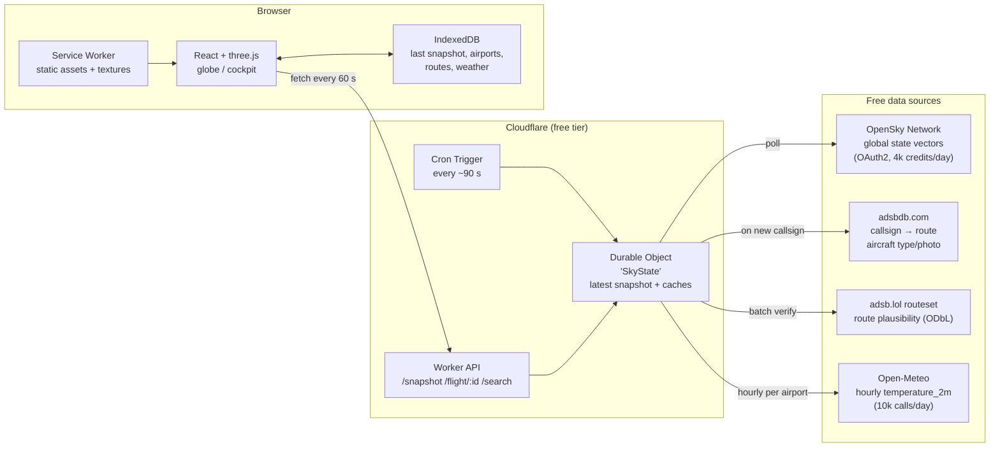
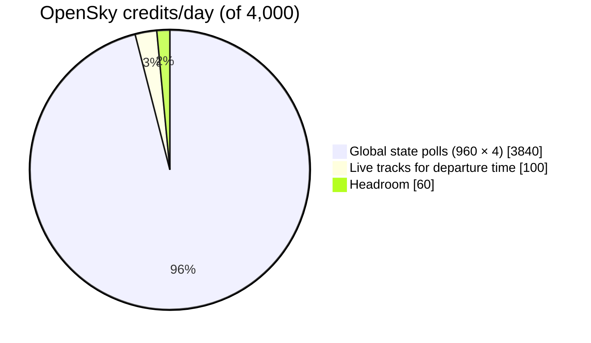
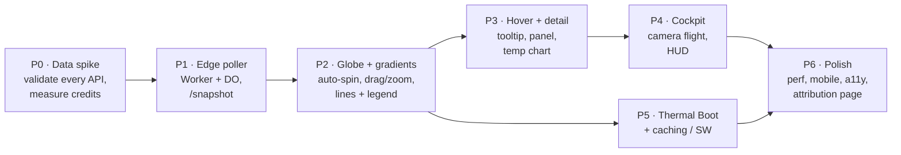

# Flight Flux: Product & Technical Plan

> **Summary.** Flight Flux is a web app built around a slowly spinning 3D globe. It shows about 150 curated long-haul flights that are in the air right now. Each flight path is a glowing line whose color blends from the **temperature at the departure city when the flight left** to the **forecast temperature at the arrival city when it lands**.
>
> All data comes from **free, keyless or free-account APIs**:
> - **OpenSky Network** for live positions
> - **adsbdb** and **adsb.lol** for callsign → route lookups
> - **Open-Meteo** for temperatures
>
> A small **Cloudflare Worker** polls these sources on behalf of every user, so rate limits are shared rather than multiplied per visitor. The browser caches heavily (Service Worker plus IndexedDB), so repeat visits show flights almost at once.
>
> A **"thermal boot" loading sequence** is driven by real loading progress. A wireframe globe assembles, transponder dots appear, routes trace themselves, and then the lines "warm up" into color.
>
> Clicking a flight flies the camera down into a **stylized first-person cockpit view** with a glass-cockpit display.
>
> **Main constraint:** every free tier used here is **non-commercial only**. Monetizing the app later would mean switching data providers (see [Risks](#9-risks--mitigations)).

Decisions already made (from the planning Q&A):

| Topic | Decision |
|---|---|
| Flight scope | Curated sample (~150 flights) + search for any airborne flight |
| API budget | Free tiers only |
| Gradient | Two-stop blend: departure temp (at departure time) → arrival forecast (at ETA) |
| Cockpit view | Stylized first-person camera + glass-cockpit display (no 3D cockpit model) |

---

## 1. Architecture at a glance



**Why a server-side poller and not direct browser calls?**
1. **Rate limits are per IP/account.** If 100 visitors each polled OpenSky, the daily quota would run out in minutes. One poller serves everyone from the same snapshot.
2. **Joining the data is expensive.** Positions, routes, departure times and weather all have to be stitched together. Doing it once on the server keeps the client payload to about 30 KB gzipped.
3. **Secrets.** The OpenSky OAuth2 client secret can't be shipped to browsers.
4. **CORS.** Not every source sends CORS headers.

---

## 2. Data sourcing (research findings)

### 2.1 Live aircraft positions: **OpenSky Network** (primary)

- `GET /api/states/all` returns every aircraft OpenSky currently sees: icao24, callsign, lat/lon, baro/geo altitude, ground speed, true track, vertical rate, and on-ground flag.
- **Auth:** OAuth2 client-credentials flow (basic auth was removed on 2026-03-18). Tokens expire after ~30 min, so the Worker refreshes them.
- **Quota:** 400 credits/day anonymous, **4,000/day registered**, 8,000/day for receiver feeders. A global query costs **4 credits**.
  - 4,000 ÷ 4 = 1,000 global pulls/day ≈ **one every 86 s**. Poll every **90 s** to leave headroom for search and track calls.
- **Time resolution:** 5 s for registered users. Between polls, the client **dead-reckons** each plane from its speed and heading, so motion stays smooth at 60 fps.
- **Departure time:** `GET /tracks/all?icao24=…&time=0` returns the live track including `startTime`. The endpoint is marked *experimental*, so plan for a fallback (§3.2). Don't use `/flights/aircraft` for this: it is filled by a nightly batch job and only covers the previous day or earlier.

**Backup / failover position sources** (all free and non-commercial, readsb-compatible JSON):

| Source | Limit | Notes |
|---|---|---|
| adsb.lol `/v2/callsign/{cs}`, `/v2/point/{lat}/{lon}/{nm}` | No key; counted per network (/24) | Point radius ≤ 250 nm. Good for search fallback. |
| adsb.fi opendata `/v2/callsign/{cs}` | 1 req/s | Same JSON shape as adsb.lol |
| airplanes.live `/v2/callsign`, `/v2/point` | 1 req/s, ≤ 1,000 aircraft/query | Educational/non-commercial only |

### 2.2 Routes (origin/destination): **adsbdb** + **adsb.lol**

ADS-B carries a callsign, not a route, so the route has to come from a separate lookup.

- **adsbdb.com** `GET /v0/callsign/{callsign}` returns airline, origin, destination (ICAO/IATA, name, city, **coordinates**). Free, no key. `GET /v0/aircraft/{icao24}?callsign=…` adds aircraft type, registration and a **photo URL** in the same call.
- **adsb.lol** `POST /api/0/routeset` with `{"planes":[{"callsign","lat","lng"}]}` is batch-capable. It returns a route plus a **plausibility flag** based on the aircraft's actual position. ODbL license, attribution required.
- **Plausibility guard (our own):** compute the plane's cross-track distance from the great circle origin→destination. If it is more than ~300 km off, or the plane is past the destination, treat the route as stale (airlines reuse callsigns) and leave the flight out of the curated set.
- **Cache:** routes rarely change, so cache them for 24 h, keyed by callsign.

### 2.3 Temperatures: **Open-Meteo**

- `GET /v1/forecast?latitude=a,b,c&longitude=x,y,z&hourly=temperature_2m&past_days=1&forecast_days=2&timezone=GMT`
  - **Comma-separated coordinates** return many airports in one request, and the response becomes an array.
  - `past_days=1` gives the **actual observed/analysis temperature at the departure hour**. Forecast hours give the **arrival temperature at ETA**.
- **Limits:** < 600/min, < 5,000/hour, **< 10,000/day**. Non-commercial; attribution (CC BY 4.0) required. Multi-location requests count each location toward the limit.
- **Budget math:** a curated set of ~150 flights touches ~200 unique airports. Refreshing every airport hourly is 200 × 24 = **4,800 calls/day**, well under the cap. Weather is cached per `(airport, hour)`, so a 48-hour series fetched once serves every flight using that airport.

### 2.4 Static reference data (bundled, no API)

- **OurAirports** CSV (public domain), trimmed to large/medium airports with IATA codes (~4k rows, ~150 KB gzipped). Used for search autocomplete, names and coordinates.
- **Airline ICAO↔IATA map** (e.g. `BA` ↔ `BAW`), so users can search "BA117" while ADS-B shows "BAW117".

### 2.5 Daily API budget



This is tight. If track calls turn out to cost more than expected, stretch polling to 120 s (2,880 credits). Dead-reckoning hides the difference visually.

---

## 3. Data model & derived values

### 3.1 Flight record (what `/snapshot` returns)

```ts
type Flight = {
  id: string;              // icao24 + departure date
  callsign: string;        // "BAW117"
  flightNo: string;        // "BA117"
  airline: { name: string; iata: string };
  aircraft?: { type: string; reg: string; photoUrl?: string };
  origin: Airport; dest: Airport;
  pos: { lat: number; lon: number; altM: number; gsKt: number; trackDeg: number; t: number };
  depTime: number;         // unix s (observed or estimated, see flag)
  eta: number;             // unix s (estimated)
  depTempC: number;        // temperature_2m at origin, depTime hour
  arrTempC: number;        // temperature_2m forecast at dest, ETA hour
  flags: { depTimeEstimated: boolean; positionEstimated: boolean };
};
```

### 3.2 Departure time and ETA

| Value | Primary method | Fallback |
|---|---|---|
| **Departure time** | OpenSky live track `startTime` (once per flight, then cached) | `now − distanceFlown / (0.85 × groundSpeed) − 15 min` (climb and taxi allowance) |
| **ETA** | `now + remainingGreatCircle / groundSpeed + 15 min` (descent and approach) | None needed (always computable) |

Recompute the ETA on every poll. If the ETA moves to a different hour, the arrival temperature updates automatically from the cached hourly series.

### 3.3 The gradient

As decided, this is a **straight two-stop blend**: `color(t) = scale(lerp(depTempC, arrTempC, t))` for t ∈ [0, 1] along the path.

- **Color scale:** one global, fixed scale so colors mean the same thing on every flight. Interpolate in **OKLab** so the middle of the blend doesn't go muddy.

  | °C | −30 | −10 | 0 | 10 | 20 | 30 | 40+ |
  |---|---|---|---|---|---|---|---|
  | Color | deep indigo | ice blue | cyan-white | mint | amber | orange | magenta-red |

- **Path geometry:** a great circle from origin to destination, drawn as a slightly raised arc. The **flown portion** is bright and solid. The **remaining portion** is dimmer, with an animated dash flowing toward the destination, which gives the motion-graphics feel.
- **Plane marker:** a small glowing chevron at the current position, tinted with the interpolated temperature at its progress point.
- **Legend:** a thin color bar along the bottom edge, with a °C/°F toggle that defaults from the browser locale.

---

## 4. Curation: which ~150 flights?

Run this every poll in the Durable Object:

1. Start from all OpenSky states that are airborne, have a callsign, and match an airline-callsign pattern (three letters + digits).
2. Keep flights with a resolved, **plausible** route and great-circle distance > 2,500 km. Long arcs look best on a globe.
3. Score them: `|arrTempC − depTempC|` (dramatic gradients first) + geographic diversity (at most N per 30° longitude band) + a bonus for wide-body types.
4. Keep the top 150, with **hysteresis**: a flight already in the set stays until it lands, so lines don't flicker in and out.
5. **Search** works on the full global snapshot, not just the curated 150. A searched flight is resolved on demand and pinned to the user's view.

---

## 5. Rendering & interaction design

### 5.1 Stack

| Layer | Choice | Why |
|---|---|---|
| Framework | **Vite + React + TypeScript** | Fast dev loop, good three.js ecosystem |
| 3D | **three.js** via **react-three-fiber** + **drei** | Full shader control for glowing gradient lines, atmosphere and bloom |
| Globe base | **globe.gl / three-globe** as a starting point (arcs layer accepts color arrays and interpolators; supports tiled imagery) | Fastest route to a good-looking globe; can be swapped for a custom R3F globe later |
| Lines | Custom `Line2`/`MeshLine` with a per-vertex color attribute + dash-offset uniform | GPU-animated flow, one draw call per batch |
| Post-processing | `@react-three/postprocessing` (Bloom, Vignette) | The "glow" look |
| Animation | **GSAP** for camera flights and UI; R3F `useFrame` for per-frame motion | Easing and timelines for transitions |
| State | **Zustand** | Simple global store for selection, camera mode, units |
| Data | **TanStack Query** + `persistQueryClient` (IndexedDB) | Polling, stale-while-revalidate, persistence |
| Charts (detail panel) | **visx** or a hand-rolled SVG | Temperature-along-route mini chart |

**Alternative considered:** CesiumJS gives real terrain and photoreal imagery for the cockpit view. However, it is ~3 MB heavier, harder to style, and the free Cesium ion tier has usage caps. A *stylized* cockpit doesn't need photoreal terrain, so three.js wins. Revisit if you later want photoreal.

### 5.2 Camera modes


- **Auto-spin:** ~2°/s around the polar axis, so the globe is never still but you can still read it. While hovering, the spin slows to 0 so the target doesn't drift out from under the cursor.
- **Drag/zoom:** `OrbitControls` with damping, pausing the auto-spin on interaction. Zoom is clamped between a full-globe view and roughly continent level.
- **Hover:** raycast against a fat invisible hit-tube for each path, because thin lines are hard to hit. The hovered line brightens, the others dim to 30%, and a tooltip follows the cursor:
  > **BA117** · British Airways · B777-300ER
  > LHR 🌡 12°C → JFK 🌡 24°C · **Δ +12°C**
  > 63% complete · lands ~14:20 local
- **Click:**
  1. A detail panel slides in on the right with: aircraft photo, route, departure/arrival times and temps, a **temperature-along-route chart** with a "you are here" marker, altitude, speed, and data-freshness badges ("departure time estimated" when the fallback was used).
  2. At the same time, a GSAP timeline flies the camera on a curved path from orbit, down past the plane marker, to cockpit position.

### 5.3 Cockpit view (stylized first-person)

- **Camera** sits at the aircraft's dead-reckoned position. Altitude is exaggerated about 3×, because 11 km is visually indistinguishable from the ground at globe scale. The camera looks along the track with ~6° downward pitch.
- **World:** higher-detail imagery tiles load near the camera. The sky uses an atmosphere scattering shader, and day/night is set from the sun's real position. At night you see city lights.
- **The gradient line continues ahead** as a glowing ribbon toward the destination over the horizon, like a heads-up-display route line.
- **Glass-cockpit HUD** (HTML/CSS overlay, not 3D):
  - Left: speed tape. Right: altitude tape. Top: heading.
  - Bottom strip: progress bar across the temperature gradient (origin temp ← plane → destination temp).
  - Corner: "local outside air temp" (blended value), time to destination, origin/destination clocks.
- **Interaction:** drag to look around with limited yaw/pitch that springs back. Esc or "Back to globe" reverses the camera flight.

---

## 6. Loading sequence: "Thermal Boot"

The loading graphic is **tied to real progress stages**, so it never lies and it ends exactly when the data is ready. On repeat visits the cached snapshot makes it play at roughly 4× speed (~1 s).

```mermaid
gantt
  title Thermal Boot (first visit, typical ~3–6 s)
  dateFormat  X
  axisFormat %s s
  section Visual
  Graticule draws (wireframe globe)         :a1, 0, 1200ms
  Continents fade in as dot-matrix          :a2, 800, 1800ms
  Transponder pings appear (white dots)     :a3, 1500, 3000ms
  Routes trace origin→plane (grey)          :a4, 2500, 4200ms
  Lines "warm up" into temperature color    :a5, 3800, 5200ms
  Camera eases into auto-spin, UI fades in  :a6, 5000, 6000ms
  section Real work it represents
  App shell + textures (SW cache)           :b1, 0, 1500ms
  /snapshot fetch (positions)               :b2, 800, 2800ms
  Routes + airports join                    :b3, 2500, 4000ms
  Weather join + color compute              :b4, 3500, 5000ms
```



**Beat by beat:**
1. **Black screen, one heartbeat.** A single thin horizontal line sweeps across the screen. Its color runs the full temperature scale, previewing the app's visual language. It curls into the equator.
2. **Graticule.** Latitude and longitude lines draw themselves with a stroke-dashoffset effect, forming a wireframe sphere that starts rotating.
3. **Dot-matrix earth.** Land masses fade in as a halftone dot field. This is cheap, looks deliberate, and works before the real texture finishes loading. It cross-fades to the real texture when ready.
4. **Transponder pings.** As positions arrive, each plane appears as a white dot with a radar-ping ring. A small counter ticks up in a split-flap / departures-board style: `ACQUIRING TRANSPONDERS ··· 1,284`.
5. **Route tracing.** Grey arcs draw from each origin to the plane's current position. Board text: `RESOLVING ROUTES ··· 147`.
6. **Warm-up.** Weather lands and each line floods with color from the origin outward, like a thermal camera coming online. Board text: `READING SKIES ··· LHR 12° · NRT 27° · DXB 38° …`, cycling real values.
7. **Hand-off.** The board flips to `FLIGHT FLUX` and fades. The camera eases into auto-spin and the UI chrome slides in.

**Rules:**
- **Skippable** with any click or key after 1 s.
- **`prefers-reduced-motion`:** replace the sequence with a static wireframe globe and a simple progress line.
- **Slow network:** if any stage takes more than 8 s, the board shows an honest status ("OpenSky is slow, using positions from 3 min ago") and continues with cached data.
- **Hard failure:** show the last cached snapshot with a "stale data" badge rather than an error screen.

---

## 7. Caching strategy

| What | Where | Policy | Effect |
|---|---|---|---|
| App JS/CSS, fonts | Service Worker (Workbox precache) | Hashed, immutable | Instant shell on repeat visits |
| Globe textures, imagery tiles | Service Worker runtime cache | Cache-first, 30 days, LRU 200 MB cap | Globe renders before network |
| Airports + airline map | Bundled JSON → IndexedDB | Versioned | Search works offline |
| Last `/snapshot` | IndexedDB (via TanStack persister) | Stale-while-revalidate | **Repeat visit shows flights at ~0 s**, dead-reckoned forward by elapsed time, then refreshed |
| Route lookups | Durable Object (24 h) + IndexedDB (24 h) | Keyed by callsign | Cuts adsbdb calls ~95% |
| Weather series | Durable Object, keyed `(airport, hour)` | Refresh hourly | Keeps within Open-Meteo quota |
| Departure times | Durable Object, keyed by flight id | Until landing | One track call per flight |
| `/snapshot` response | Cloudflare edge cache, `s-maxage=30` | Shared across users | Worker CPU stays tiny |

**Durable Object, not KV:** the Workers KV free tier allows about 1,000 writes/day, and a 90 s poller needs 960. A single Durable Object holds the snapshot and caches in memory with SQLite persistence, without that limit.

---

## 8. Build phases



| Phase | Deliverable | Exit criteria |
|---|---|---|
| **P0** Data spike | Scripts hitting OpenSky (OAuth2), adsbdb, adsb.lol routeset, Open-Meteo | Real credit cost of `/tracks` known; route hit-rate for long-haul callsigns ≥ 80% |
| **P1** Edge poller | Cloudflare Worker + cron + Durable Object; `/snapshot`, `/flight/:id`, `/search` | Snapshot of ≥ 120 curated flights with temps, refreshed every 90 s, within quotas for 48 h |
| **P2** Globe | R3F globe, atmosphere, gradient arcs, dead-reckoned markers, auto-spin with pause/resume | 60 fps on a mid-range laptop with 150 flights |
| **P3** Interaction | Hover tooltip, click panel, temperature chart, search box | Hit-testing feels effortless; search finds a flight by "BA117" or "BAW117" |
| **P4** Cockpit | Camera fly-in/out, first-person camera, HUD, day/night | Transition never clips through the globe; Esc always returns |
| **P5** Boot + cache | Thermal Boot tied to real progress; SW + IndexedDB persistence | First visit < 6 s on 4G; repeat visit shows flights in < 1 s |
| **P6** Polish | Mobile touch gestures, reduced-motion, keyboard nav, attribution/credits page, error states | Lighthouse perf ≥ 80 on mobile; all data licenses credited |

---

## 9. Risks & mitigations

| Risk | Impact | Mitigation |
|---|---|---|
| **Non-commercial licenses** (OpenSky, Open-Meteo free, airplanes.live, adsb.lol ODbL attribution) | Can't monetize as-is | Keep source adapters behind one interface. Swap-in commercial options: FlightAware AeroAPI / FR24 API (positions + routes), Open-Meteo paid tier |
| **Oceanic coverage gaps:** ground-based ADS-B can't see mid-Atlantic/Pacific | Long-haul planes "freeze" or vanish mid-ocean | Dead-reckon along the great circle toward the destination and show an "estimated position" dashed marker until coverage resumes |
| **Stale or wrong routes** (callsign reuse) | Wrong arcs | Cross-track plausibility guard (§2.2); adsb.lol plausibility flag; drop rather than guess |
| **Community APIs have no SLA** | Outages | Failover chain OpenSky → adsb.lol → adsb.fi; serve last good snapshot with a stale badge |
| **OpenSky `/tracks` is experimental** | No observed departure time | Estimation fallback (§3.2), flagged in the UI |
| **Quota exhaustion** from search traffic | Snapshot gaps | Search reads from the in-memory global snapshot, which needs no extra OpenSky call; per-IP rate limit on `/search` |
| **GPU load on low-end phones** | Jank | Adaptive quality: drop bloom, halve line segments, cap at 75 flights when frame time > 20 ms |

---

## 10. Open questions for you

1. **Auto-spin resume:** the plan resumes spinning after 10 s idle. Do you want that, or should the globe stay paused until the user clicks a "resume spin" control?
2. **Units:** default to °F or °C from the browser locale, with a toggle. OK?
3. **Mobile priority:** first-class (touch gestures, bottom-sheet detail panel) from P2, or desktop-first with mobile in P6?
4. **Hosting:** Cloudflare (Workers + Pages, free) is the recommendation. Do you have an existing preference or account?
5. **OpenSky account:** you'll need to register (free) and create OAuth2 API client credentials. I can't do that step for you.

---

## Sources

- OpenSky REST API docs: https://openskynetwork.github.io/opensky-api/rest.html · FAQ: https://opensky-network.org/about/faq
- OpenSky OAuth2 / credit details (community write-ups): https://github.com/joostlek/python-opensky/issues/932 · https://freeapihub.com/apis/opensky-network-api
- adsbdb: https://www.adsbdb.com/ · https://github.com/mrjackwills/adsbdb
- adsb.lol routeset / API notes: https://github.com/stevenpickles/flightsite/issues/168 · https://github.com/tedivm/skysnoop
- adsb.fi opendata: https://github.com/adsbfi/opendata/blob/main/README.md
- airplanes.live API: https://github.com/airplanes-live/api/blob/main/README.md
- Open-Meteo pricing/terms/docs: https://open-meteo.com/en/pricing · https://open-meteo.com/en/terms · https://open-meteo.com/en/docs
- Free flight API comparison 2026: https://skylinkapi.com/blog/best-free-flight-tracking-apis-2026-when-to-pay/
- globe.gl / react-globe.gl: https://globe.gl/ · https://github.com/vasturiano/react-globe.gl
- Oceanic ADS-B coverage: https://arxiv.org/pdf/2505.06254
